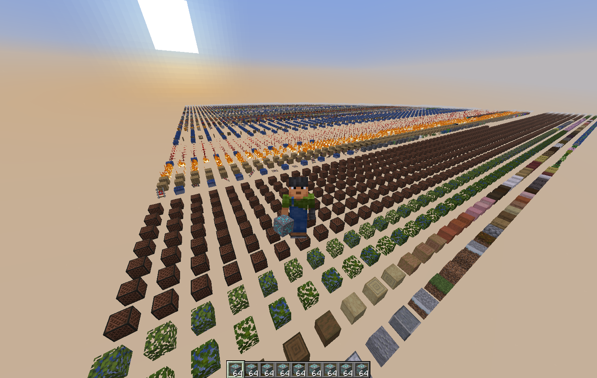

# Cerium

Yet another high-performance Minecraft server library written in Rust.

> [!CAUTION]
> This repository is still in a very, very, very early stage of development.

## Goals

- High-performance
- Lightweight
- Easy to use


## Roadmap

- Protocol
    - [x] Server list ping
    - [x] Encryption
    - [x] Compression
    - [x] Joining a world
    - [x] Registries
- World
    - [ ] Blocks
    - [ ] Entities
    - [ ] Block Interactions
    - [ ] Light API
    - [ ] Chunk Generation API
    - [ ] Batching
- Entity
    - [ ] Entity API
    - [ ] Entity Metadata
- [ ] Item/Inventory API
- [ ] Commands
- [x] Text components
- [ ] Event system
- [ ] Resource Pack Support
- [ ] Advancements
- [ ] Proxy Support
- [ ] Scoreboards

Of course, more features are planned for the future.


## Examples

- Debug World
- Flat World
- Npc
- Text

## Running

```sh
cargo r --example debug_world
```

```rust
fn main() {
    let server = Server::new();

    let world = World::new(&DimensionType::OVERWORLD);

    for (ix, pos) in (0..27946).enumerate() {
        let bz = (pos / 168) + 1;
        let bx = (pos % 168) + 1;

        let block = BlockState::from_id(ix as i32).unwrap();
        world.set_block((bz * 2) - 1, 70, (bx * 2) - 1, block);
    }

    server
        .events()
        .subscribe(move |event: &mut PlayerConfigEvent| {
            event.set_world(world.clone());
            event.set_position((0.5, 71., 0.5));
        });

    server.bind("127.0.0.1:25565").unwrap();
}

```


